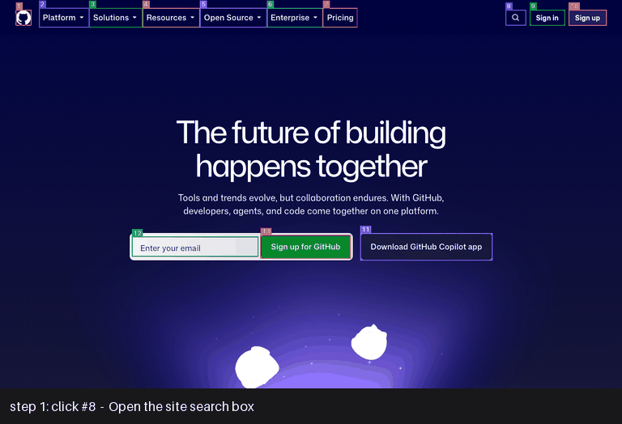

# aesopic-navigator

A vision-model-driven agent that opens github.com, searches for a repository,
clicks through to its Releases page and extracts the latest release as JSON.
No CSS selectors, no XPath: the model looks at screenshots and decides what to
click.



```bash
navigate --repo openclaw/openclaw
```

```json
{
  "repository": "openclaw/openclaw",
  "latest_release": {
    "version": "openclaw 2026.9.8",
    "tag": "v2026.9.8",
    "commit": "fc23bc8",
    "author": "github-actions",
    "published_at": "2 days ago",
    "is_prerelease": false,
    "release_notes": "OpenClaw v2026.9.8 ...",
    "download_links": [
      {"name": "OpenClaw-2026.9.8-arm64.dmg", "url": "https://github.com/openclaw/openclaw/releases/download/v2026.9.8/OpenClaw-2026.9.8-arm64.dmg"},
      "..."
    ]
  },
  "run": { "status": "success", "steps": 5, "verification": "agree", "cost_usd": 0.11, "wall_time_s": 55.4, "...": "..." }
}
```

## Setup

Requires Python ≥ 3.10, [uv](https://docs.astral.sh/uv/) and an Anthropic API key.

```bash
make setup                      # venv, deps, Chromium
cp .env.example .env            # then put ANTHROPIC_API_KEY=... in .env
make test                       # 70 tests, no network, no key needed
make demo                       # the take-home task -> sample_output.json
pyproject.toml + uv.lock   dependencies
```

Without `make`: `uv venv && uv pip install -e ".[dev]" && .venv/bin/python -m playwright install chromium`.

## Usage

```bash
# simple interface
navigate --repo openclaw/openclaw

# natural-language interface
navigate --url https://github.com --prompt "search for openclaw and get the current release and related tags"

# any repository; notes, date and download links (a second pass expands the Assets section)
navigate --repo pallets/flask --out flask.json

# watch it
navigate --repo openclaw/openclaw --headed --slow-mo 300

# the alternatives kept for comparison
navigate --repo openclaw/openclaw --grounding som         # Set-of-Mark numbered labels instead of coordinates
navigate --repo openclaw/openclaw --extraction vision     # skip text verification
navigate --repo openclaw/openclaw --full                  # add the pre-verification vision read, token usage, timestamps
navigate --repo openclaw/openclaw --skip-assets           # skip the assets pass (saves ~3 steps, ~$0.07)
navigate --repo openclaw/openclaw --model claude-opus-5   # default is Sonnet 5 for coords, Opus 5 for som
```

JSON goes to stdout, progress to stderr, exit code 0 only on success. The
default output is the answer plus a short `run` summary; `--full` prints the
whole record (the vision read before verification, token usage, timestamps),
which the trace's `run.json` always contains. Every run
writes a trace to `runs/<timestamp>_<name>/`: the exact screenshot the model saw
at each step (`step_NN.png`; badges included in Set-of-Mark mode), a JSON record
per decision, the final page and the page text used by the verifier.

## How it works

```
goal ─► screenshot ─► model picks ONE action (click at x,y / type / scroll / press / back / done)
                                                                                │
         ◄──────────── wait for navigation, detect page change, record ─────────┘
                                   (repeat ≤ 15 steps)
                                        │ done
                                        ▼
            vision read of the final page ─► verify strings against page text ─► JSON
```

- **Grounding (pixel coordinates, by experiment).** The model is asked for the
  centre of the element it wants, in screenshot pixels. The viewport is fixed at
  1280×800 at 1x so the screenshot maps 1:1 onto the page. This was *not* the
  plan: the plan was Set-of-Mark (the harness draws a numbered badge on every
  interactable found by a site-agnostic scan, and the model answers with a
  number). A pre-registered 60-run experiment on Opus 5 found both at 30/30
  task success, coordinates within 2 px of element centres on every click, and
  Set-of-Mark with three wrong-badge clicks. A replication on Sonnet 5 widened
  the gap: coordinates 30/30, Set-of-Mark 27/30 with three runs stuck asking
  for a badge that did not exist. So coordinates are the default and
  Set-of-Mark is `--grounding som`. The same data picks the default model:
  Sonnet 5 with coordinates (30/30 at 40% of the cost), Opus 5 with Set-of-Mark.
  → [ADR 001](docs/adr/001-grounding-coordinates-over-set-of-mark.md), [by model](experiments/RESULTS_grounding_by_model.md)
- **Extraction.** Structured-output read of the final screenshot, then a second
  call that checks each string against the page's rendered text and reports any
  correction. Output includes whether the two agreed.
  → [ADR 002](docs/adr/002-extraction-verified-against-page-text.md)
- **Assets, as a separate pass.** After the core fields are safe, a bounded
  sub-task (≤ 4 steps) expands the release's collapsed Assets section, reads the
  file names, drops any name not present in the page text, and resolves each to
  a download URL by matching the visible text of a link. Putting this in the
  main goal instead was measured to scroll the core fields off-screen.
- **Memory.** Each step is a single-turn request: system prompt + goal + a text
  history of prior actions and outcomes + the current screenshot. Cost is flat
  per step and the agent's memory is readable in the trace.
  → [ADR 003](docs/adr/003-action-schema-and-single-turn-memory.md)
- **Reliability.** Step budget, wall-clock timeout, page-change detection
  (URL/title/scroll plus a pixel diff), loop detection on ineffective actions,
  a "you appear stuck" hint, invalid actions fed back to the model, and any
  crash becomes a JSON error with a trace, never a stack trace.

### The `tag` field

The brief's sample output has `"tag": "77e703c"`, which is a short commit SHA.
GitHub's release card shows both the git tag and the commit. We return
`tag` (e.g. `v2026.9.8`) and `commit` (e.g. `fc23bc8`) separately.

## Testing

| Layer | Command | What it proves | Needs |
|---|---|---|---|
| Unit | `make test` | overlay geometry, asset-name verification, click resolution incl. rescaling, loop signatures, pixel diff, URL parsing, vision-vs-text diffing | nothing |
| Replay | `make test` | the whole agent loop against a scripted model and fake browser: happy path, coordinate attribution, step budget, loop detection, stuck hint, abort, invalid label, model errors, browser crash, timeout | nothing |
| Live | `make test-live` | one real run scored against the GitHub API | network + key (~$0.20) |
| Experiment | `make experiment-grounding` | 60 scored navigations, Set-of-Mark vs coordinates (run on Opus 5 and Sonnet 5) | ~$11 / ~$4 |

CI runs lint, mypy (strict) and the first two layers on every push.

## Repository map

```
navigator/        the tool: browser.py, grounding.py, agent.py, assets.py, llm.py, prompts.py, trace.py, cli.py
tests/            unit + replay (fakes.py) + opt-in live
experiments/      oracle snapshots, runners, analysis, RESULTS_*.md, traces of every scored run
docs/adr/         architecture decision records
docs/observation-notes.md   raw chronological notes from the build
OBSERVATIONS.md   the write-up: decisions, experiments, what broke, what is next
sample_output.json
pyproject.toml + uv.lock   dependencies
```

## Limitations

- **Text verification reads the DOM generically** (`innerText`, no selectors).
  A `<canvas>` app or cross-origin iframe defeats it; `--extraction vision` is
  the strictly pixel-based fallback. Navigation itself is pixel-only by default.
- **One viewport.** 1280×800 at 1x, chosen so the screenshot maps 1:1 onto the
  page and stays under the API's resize threshold. Smaller screens would push
  GitHub's Releases link (at y≈787) below the fold and cost a scroll.
- **GitHub bot detection** is not handled beyond a realistic user agent; a
  rate-limit page would end the run with `abort`.
- **Relative dates, partial asset lists.** `published_at` is whatever the page
  shows ("18 hours ago"). The assets pass reads the names visible in one
  screenshot after expanding the list: 12 of the 19 listed for openclaw, since the
  rest sit below the fold.
- **Cost/latency.** ~$0.06 and ~34 s per run for the core fields on the
  default model (Sonnet 5 with coordinates, 30/30 in the experiment), ~$0.15
  and ~40 s on Opus 5, plus ~$0.07 and ~15 s for the assets pass.

See [OBSERVATIONS.md](OBSERVATIONS.md) for the full discussion.
